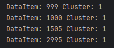
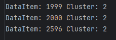
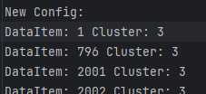
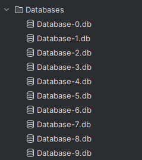
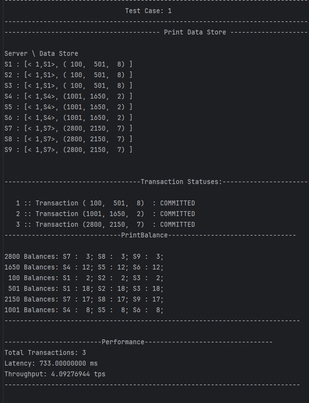

# Server Configurations

## Overview
This document outlines the configurations for the servers and the View Server responsible for handling transactions.

## Server Details
The following servers have been considered:

| Server Name          | Port Number |
|----------------------|-------------|
| S1                   | 8001        |
| S2                   | 8002        |
| S3                   | 8003        |
| S4                   | 8004        |
| S5                   | 8005        |
| S6                   | 8006        |
| S7                   | 8007        |
| S8                   | 8008        |
| S9                   | 8009        |
| Client / View Server | 8000        |
|                      |             |


## View Server
This is actually not a View Server by definition. This is just a bridge between Input File and servers.

Like an Input Controller Client. This represents a Client that sends transactions to all the servers.

## Commands

| Command Names    | Command Details                                       |
|------------------|-------------------------------------------------------| 
| PrintDataStore   | Prints Datastore of each server                       |
| PrintStatus      | Prints All Transaction SeqNum statuses across servers |
| PrintBalance     | Prints Balance of Data Items in cluster's servers     |
| PrintPerformance | Prints Performance                                    |


## During Execution
After every Test Set, code automatically sends PrintDataStore, PrintStatus, PrintBalance and PrintPerformance commands to the servers.
The Outputs will be logged to "Logs/8000-Commands.txt" file

PrintBalance will be sent for all participating DataItems and will be logged.

## Bonus 1 - Resharding - Shard Redistribution

**Approach 1: ReDistribution with Frequent Items and Round Robin**

Based on Highly used data items, the data items are redistributed to the servers. I've used round-robin method to make sure all clusters get equal number of data items.
All Clusters would have highly used and unused data items.

But this way, Data Items are getting redistributed so much. which is making the RPC calls very slow and ReShard/ Distribution is taking more time.

**Approach 2: ReDistribution with Frequent Item Pairs and SWAPs**

Similar to previous approach, but instead of redistributing all data items, only the highly used data item pairs are SWAPPED between the clusters.
This way, the RPC call execution time is reduced and the distribution is faster.

This is the Updated Config Output. I see some items got swapped across the clusters.

    


Redistribution Logs are in "Logs/0-ReSharding.txt" file


## Bonus 2 - Configurable Clusters

Edit the configuration definitions like TOTAL_SERVERS, CLUSTER_SIZE and TOTAL_DATA_ITEMS in run_java.bat file to configure the cluster size and data items. 
Dynamically creates the Clustering schemes based on these values.


### Persistent DataStore - SQLite3




## All Outputs will be logged to "Logs/8000-Commands.txt" folder


```